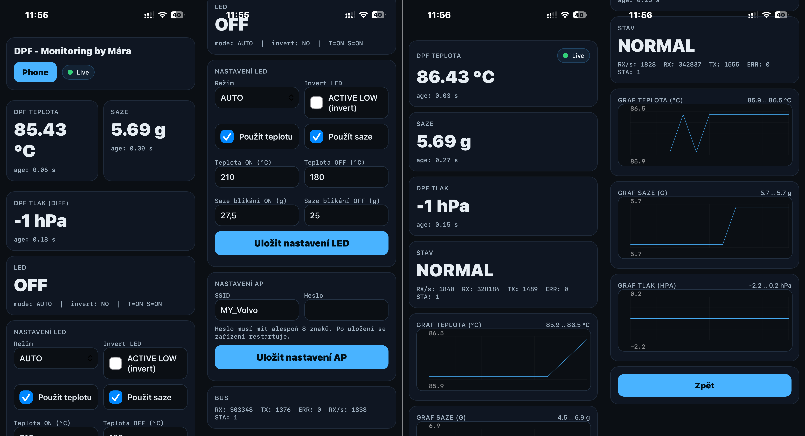
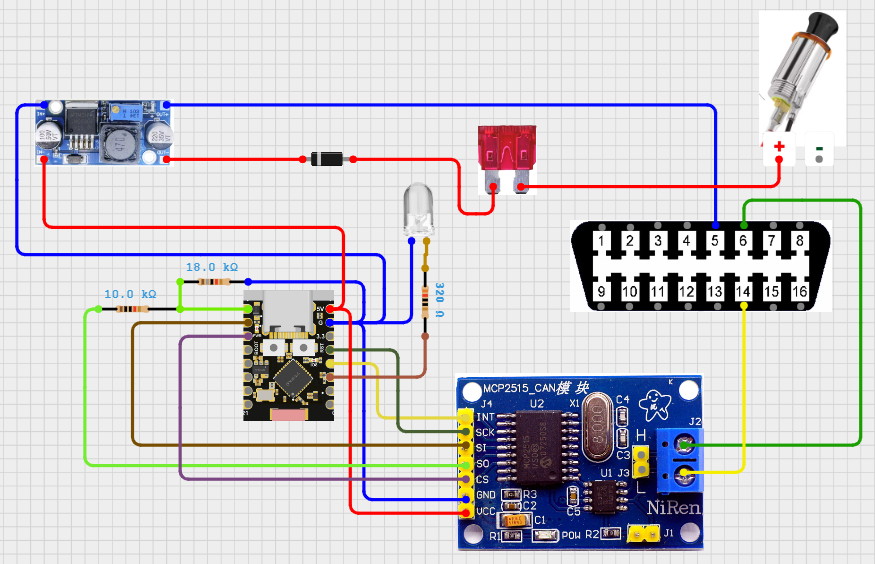
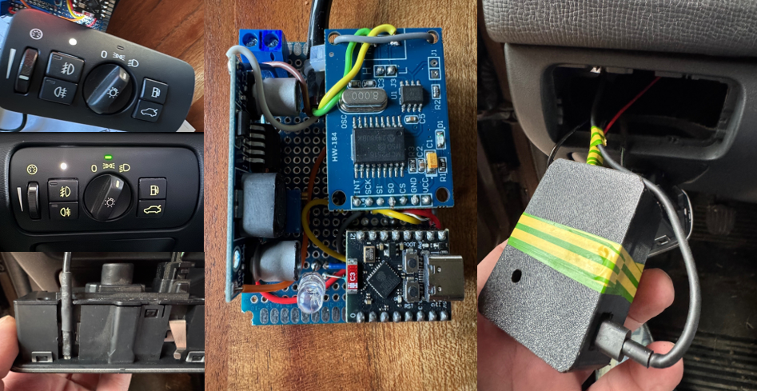
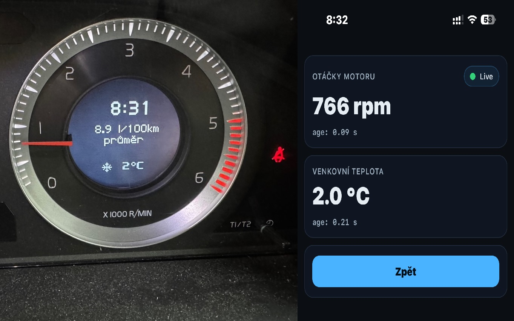

Englich version
# Volvo DPF Indicator

Tutorial on how to build your own DPF indicator for Volvo cars (2009–2016) using ESP32 Super Mini.

## How the DPF indicator works

The DPF indicator reads DPF temperature and soot level.

In the main menu you can configure the LED indicator.  
For soot level the LED will blink, and for temperature it will stay on.

On my Volvo XC60 (2010) the DPF regeneration starts at around **28.5 g of soot**.  
The temperature rises from **180°C to about 230–240°C**, which means regeneration has started.

After about **10 minutes of driving**, the soot level drops to **0.0 g**.  
At that moment the DPF temperature begins to drop back to about **180°C**, which takes roughly **2 minutes**.

I can set the soot warning to **28 g**, and when this level is reached the LED starts blinking.  
This means regeneration is about to start.

If I set the temperature threshold to **210°C**, the LED turns on when regeneration starts and stays on until the temperature drops below **190°C**.

From my observations, during my daily commute the car produces about **1 g of soot every 60 km**.

The first two screens show the **main menu**.  
The next two screens show the **phone version**.

---

# What you will need

## Software
1. Arduino IDE with required libraries installed.

## Hardware
1. ESP32 Super Mini  
2. Adjustable step-down converter **LM2596 DC-DC**  
   ⚠ Important: Before connecting anything, set the output voltage to **5V** using the trim potentiometer.  
   Connect the converter to a **12V source first** and adjust it to about **5.05V** while measuring the output voltage.  
   Otherwise you may damage the components.  
3. MCP2515 CAN Bus Module TJA1050 SPI  
4. Diode **1N4148**  
5. LED diode (choose any color)  
6. Resistors **10kΩ, 18kΩ** for voltage divider and **320Ω** for the LED  
7. Universal PCB board **50×70 mm**  
8. Cable **3×1mm** for GND, CANH, CANL connected to the back of the **OBD2 connector**  
9. Wire **1mm** for **12V power from cigarette lighter**  
10. **500 mA fuse** and fuse holder  
11. **OBD connector** if you want a plug-and-play version

---

# Wiring diagram

For testing you can take **12V directly from OBD2 pin 16**, but since that pin has **constant voltage**, it is better to connect power to **12V from the cigarette lighter**, which turns on only after the engine starts.

---

# Example build

This is how my prototype looks.  
The **microUSB cable** is only used in case I want to update the firmware.

---

# Uploading firmware to ESP32

1. Set board to **NOLOGO ESP32C3 Super Mini**
2. Install library **ACAN2515.h** by Pierre Molinaro
3. After opening the `.ino` file you can upload the firmware
4. If the MCP2515 CAN Bus Module is wired incorrectly, the ESP32 will not boot
5. When everything is working, connect to WiFi: MY_VOLVO password 12345678 and web browser http://192.168.4.1 
---

# Demo version

The demo version shows **engine RPM and outside temperature**.

If everything works correctly you can download the full version.

Free demo firmware:

[Download demo .ino](demo.ino)

---

# Full version

Full firmware with complete `.INO` source code is available here:

➡ https://marekverse80.gumroad.com/l/qpyikp
---
---
---
CZ verze
# Volvo-DPF-indikátor
Návod jak si vyrobit vlastní DPF indikátor pro vozy Volvo. 2009 - 2016 přes ESP32 super mini

## DPF indikátor funguje tak, že čte teplotu DPF a saze.

V hlavním menu je možnost nastavení LED diody. Pro saze bliká a pro teplotu svítí. 

Na mém Volvu XC60 rv2010 se spustilo vypalování DPF filtru při cca 28,5g. Teplota vzorsta ze 180°C na 230-240° a začlo vypalování. Cca za 10 minut jízdy saze spadly na 0.0g a v té chvíly se teplota DPF začala snižovat na 180°C cca asi 2 minuty.
Můžu si nastavit saze na 28g a v té chvíli začne led blikat. Znamená to pro mě, že se blíží vypalování.
Když nastavít teplotu na 210 tak při této teplote už startuje vypalování. Led kontrokla svítí dokud teplota neklesne pod 190°C
Vysledoval jsem, že každý den cestou do práce a z práce mi to udělá 1g sazí při 60 ujetých kilometrech.

První dvě orazovky jsou havní menu. Další dvě obrazovky je phone verze.

## Co budeme potřebovat.
- Software
1. Arduino IDE a nainstalované potřebné knihovny.

- Hardware
1. ESP32 super mini
2. Step down nastavitelný měnič s LM2596 DC-DC (Tady velký pozor. Nejdřív si nastavte na outputu 5V trimrem. Přijpoj si samotný měnič na zdroj 12V a nastav si 5.05V sleduj meřák na outputu. Jinak spálíš všechno co tam bude.)
3. MCP2515 CAN Bus Modul TJA1050 SPI
4. Diodu 1N4148
5. Led diodu. Barvu si zvol sám.
6. Odpory 10kOhm,18kOhm pro dělič napětí a 320Ohm pro ledku.
7. Univerzální plošný spoj 50x70mm
8. Kabel 3x1mm pro GND, CANH, CANL který se napojí zezadu na konektor OBD 2. Vodič 1mm pro 12V ze zapalovače.
9. Pojitku 500mA a pojistkové lůžko.
10. OBD konektor když chceš verzi plug and play.

## Schéma zapojení.

Pro zkoužku si můžeš půjčit 12V přímo z OBD2 na pinu 16, ale protože je tam trvalé napětí, tak je lepší to zapojit na 12V ze zapalovače. Ten se zapne až po nastartování.

Jak to vypadá u mě. Ten microUSB je tam jen kabel, kdybych chtěl software aktualizovat.

## Nahrání do ESP32.
1. jako board si nastav NOLOGO ESP32C3 Super mini
2. stáhni si knihovnu ACAN2515.h od Pierre Molinaro
3. po vložení INA můžeš nahrávat.
4. Pokud špatně zapojíš MCP2515 CAN Bus Modul TJA1050 SPI esp32 vůbec nenaběhne.
5. Když je vše OK tak se připoj na wifi MY_VOLVO a heslo je 12345678. Do adresy dej http://192.168.4.1

## Demo version - ukazuje otáčky a venkovní teplotu. Pokud ti to bude fungovat můžes si stáhnout plnou verzi.

Free demo firmware:

[Download demo .ino](demo.ino)

## Full version

Full firmware with complete `.INO` source code is available here:

➡ https://marekverse80.gumroad.com/l/qpyikp
